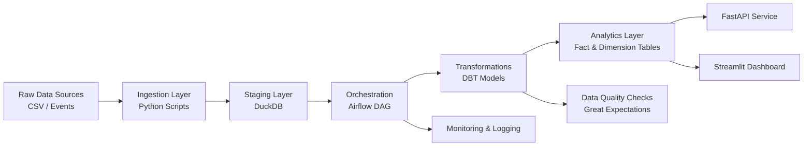

# Data Platform for Billing & Product Analytics

A full-stack, production-style data platform that simulates how modern organizations ingest, transform, validate, and serve data for analytics, reporting, and machine learning use cases.

This project demonstrates end-to-end data engineering workflows using industry-standard tools such as Airflow, dbt, DuckDB, FastAPI, and Streamlit.

---

## Problem Statement

Modern organizations rely on accurate, timely, and well-modeled data to power:

- Financial reporting
- Product analytics
- Operational dashboards
- Machine learning workflows

However, many systems suffer from:

- Fragile ETL pipelines
- Lack of data validation and observability
- Poorly structured data models
- Limited access for non-technical users

This project simulates a **production-grade data platform** designed to solve these challenges by building a reliable, scalable, and testable pipeline from ingestion to consumption.

---

## Architecture Overview



---
## Tech Stack

| Layer          | Technology             |
| -------------- | ---------------------- |
| Ingestion      | Python, Pandas         |
| Orchestration  | Airflow                |
| Transformation | dbt                    |
| Data Warehouse | DuckDB (local)         |
| API Layer      | FastAPI                |
| Dashboard      | Streamlit              |
| ML             | Scikit-learn           |
| Data Quality   | Great Expectations     |
| DevOps         | Docker, GitHub Actions |

---
## Data Flow
1. Data Generation
   * Synthetic billing and customer datasets are generated using Python scripts
2. Ingestion
   * Raw CSV files are ingested into DuckDB staging tables
3. Orchestration
   * Airflow DAG coordinates ingestion, transformation, validation, and model training
4. Transformation
   * dbt models create:
      * Fact tables (billing metrics)
      * Aggregated analytics datasets
5. Data Quality
   * Validation checks ensure:
      * No null values
      * Data consistency
      * Schema integrity
6. Serving Layer
   * FastAPI exposes analytics endpoints
   * Streamlit dashboard enables self-service analytics

---
## Features


* End-to-End Data Pipeline
   * Ingestion → Transformation → Serving → Visualization
* Modular Data Modeling
   * dbt-based transformations with reusable models
* Workflow Orchestration
   * Airflow DAG manages pipeline dependencies and execution
* Data Quality Checks
   * Validation rules ensure reliable outputs
* API Layer
   * FastAPI exposes analytics data for downstream applications
* Interactive Dashboard
   * Streamlit dashboard for non-technical users

---
## How to Run


1. Create a Python venv and install:
   ```bash
   python -m venv .venv
   source .venv/bin/activate
   pip install -r requirements.txt
   ```
2. Generate sample data:
   ```bash
   python scripts/generate_data.py --output_dir data/raw --n_customers 500 --n_events 5000
   ```
3. Ingest synthetic data into DuckDB:
   ```bash
   python ingest/ingest_billing.py
   ```
4. Build dbt marts
   ```bash
   dbt run --profiles-dir dbt
   ```
5. Start API
   ```bash
   uvicorn api.app:app --reload --port 8000
   ```
6. Start Dashboard
   ```bash
   streamlit run dashboard/streamlit_app.py
   ```

---
## Key Takeaways

This project demonstrates:
* Building scalable, production-like data pipelines
* Designing analytics-ready data models
* Implementing orchestration and automation
* Enabling self-service analytics
* Integrating ML into data platforms